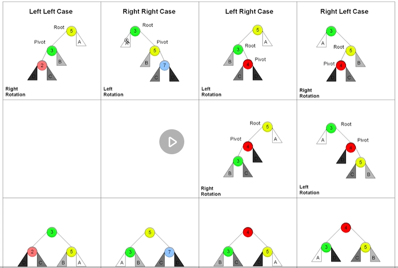

# 期末总结
---

<a name="index">**Index**</a>

&emsp;<a href="#0">0 感想</a>  
&emsp;<a href="#1">1 学习方法与思想</a>  
&emsp;&emsp;<a href="#2">1.1 五毒神掌</a>  
&emsp;&emsp;<a href="#3">1.2 面试切题四件套</a>  
&emsp;&emsp;<a href="#4">1.3 学习TIPS</a>  
&emsp;&emsp;<a href="#5">1.4 Tricks（部分是自己敲代码的感受）</a>  
&emsp;<a href="#6">2 数据结构与算法知识点</a>  
&emsp;&emsp;<a href="#7">2.1.1. 数组、链表、跳表</a>  
&emsp;&emsp;<a href="#8">2.1.2. 栈、队列、优先队列、双端队列</a>  
&emsp;&emsp;<a href="#13">2.2.1 哈希表、映射、集合</a>  
&emsp;&emsp;<a href="#14">2.2.2 树、二叉树、二叉搜索树</a>  
&emsp;&emsp;&emsp;<a href="#15">2.2.2.1 二叉树</a>  
&emsp;&emsp;&emsp;<a href="#26">2.2.2.2 二叉搜索树(BST, Binary Search Tree)：</a>  
&emsp;&emsp;<a href="#27">2.2.3 堆和二叉堆</a>  
&emsp;&emsp;<a href="#28">2.2.4 图(Graph)</a>  
&emsp;&emsp;<a href="#29">2.3.1 泛型递归、树递归</a>  
&emsp;&emsp;<a href="#35">2.3.2 分治、回溯</a>  
&emsp;&emsp;&emsp;<a href="#36">2.3.2.1 分治</a>  
&emsp;&emsp;&emsp;<a href="#43">2.3.2.2 回溯</a>  
&emsp;&emsp;<a href="#51">2.4.1 深度优先搜索和广度优先搜索</a>    
&emsp;&emsp;<a href="#62">2.4.2 贪心算法</a>  
&emsp;&emsp;<a href="#63">2.4.3 二分查找</a>  
&emsp;&emsp;<a href="#66">2.5.1 动态规划（即递推）</a>  
&emsp;&emsp;&emsp;<a href="#67">2.5.1.1 理解</a>  
&emsp;&emsp;&emsp;<a href="#68">2.5.1.2 步骤</a>  
&emsp;&emsp;<a href="#69">2.6.1 字典树 Trie树</a>  
&emsp;&emsp;<a href="#70">2.6.2 并查集</a>  
&emsp;&emsp;<a href="#71">2.6.3 高级搜索</a>  
&emsp;&emsp;&emsp;<a href="#72">2.6.3.1 剪枝</a>  
&emsp;&emsp;&emsp;<a href="#79">2.6.3.2 双向搜索</a>  
&emsp;&emsp;&emsp;<a href="#81">2.6.3.3 启发式搜索（A*）</a>  
&emsp;&emsp;<a href="#82">2.6.4 红黑树和AVL树</a>  
&emsp;&emsp;&emsp;<a href="#83">2.6.4.1 AVL树: 完全平衡二叉树</a>  
&emsp;&emsp;&emsp;<a href="#84">2.6.4.2 红黑树: 近似平衡二叉树</a>  
&emsp;&emsp;<a href="#85">2.7.1 位运算</a>  
&emsp;&emsp;&emsp;<a href="#86">2.7.1.1 二进制基础概念：</a>  
&emsp;&emsp;&emsp;<a href="#87">2.7.1.2 位运算基本操作：</a>  
&emsp;&emsp;&emsp;<a href="#88">2.7.1.3 异或技巧</a>  
&emsp;&emsp;&emsp;<a href="#89">2.7.1.4 位运算常用技巧：</a>  
&emsp;&emsp;&emsp;<a href="#90">2.7.1.5 指定位置的位运算：</a>  
&emsp;&emsp;<a href="#91">2.7.2 布隆过滤器和LRU缓存</a>  
&emsp;&emsp;&emsp;<a href="#92">2.7.2.1 布隆过滤器</a>  
&emsp;&emsp;&emsp;<a href="#93">2.7.2.2 LRU缓存</a>  
&emsp;&emsp;<a href="#94">2.7.3 排序算法</a>  
&emsp;&emsp;&emsp;<a href="#95">2.7.3.1 初级排序</a>  
&emsp;&emsp;&emsp;&emsp;<a href="#96">2.7.3.1.1 冒泡排序</a>  
&emsp;&emsp;&emsp;&emsp;<a href="#97">2.7.3.1.2 选择排序</a>  
&emsp;&emsp;&emsp;&emsp;<a href="#98">2.7.3.1.3 插入排序</a>  
&emsp;&emsp;&emsp;&emsp;<a href="#99">2.7.3.1.4 希尔排序</a>  
&emsp;&emsp;&emsp;<a href="#100">2.7.3.2 高级排序</a>  
&emsp;&emsp;&emsp;&emsp;<a href="#101">2.7.3.2.1 归并排序</a>  
&emsp;&emsp;&emsp;&emsp;<a href="#102">2.7.3.2.2 快速排序</a>   
&emsp;&emsp;&emsp;&emsp;<a href="#105">2.7.3.2.3 堆排序</a>  
&emsp;&emsp;&emsp;<a href="#106">2.7.3.3 特殊排序(非比较类排序)</a>  

## 0 感想

 - 学到了很多东西也发现了还有很多不会的东西，u1g1群里学习氛围不能算很好，每周都会有很多同学掉队。
 - 同为社畜能理解是有很多身不由己的因素，但是也还是不够重视吧。
 - （重点是训练营不便宜呀各位怎么这么有钱呢）
 - 所以能坚持到最后还是很开心的，同时也很唏嘘。
 - 课程设置上我觉得后半段的内容较多较赶。甚至我能感受到后半段很多课程带着一点敷衍。
 - btw，超哥，n皇后的位运算解法虽然期末直播回看的讲解我听懂了但是说好的单个录个视频去哪了hhhh。
 - 总之还是很感谢的，总体来说，钱是花的值的。
 - 甚至这个评价，不是针对算法与数据结构的课程本身，很多学习方法与思想就让我大呼内行——
 - “原来还可以这样子！”
 - “牛逼牛逼！”
 - “十分科学！”
 - “XXfine秒mine”

## 1 学习方法与思想

### 1.1 五毒神掌

过遍数 刻意练习 不能死磕 不能只做一遍

 - 第一遍：5分钟内没有思路直接看题解； 
 - 第二遍：自己做； 
 - 第三遍：一天后再次刷；
 - 第四遍：一周后刷； 
 - 第五遍：面试前一周恢复性训练。

考虑多种解题思路，分析时间/空间复杂度，看高票题解

### 1.2 面试切题四件套

 - 1. clarification
 - 2. possible solutions ->optimal time and space
 - 3. code
 - 4. test

### 1.3 学习TIPS

 - 费曼学习法 以教促进学
 - 打破自己的思维惯性，形成机器思维
 - 善用脑图
 - 分清优先级
 - 碎片时间学习
 - 学习算法不必看算法导论
 - 加固语言基础
 - 熟练IDE的快捷键操作（Pycharm: Home/End行首行尾 Ctrl+方向键按词移动 Shift选中）

### 1.4 Tricks（部分是自己敲代码的感受）
- 空间换时间 升维
- list.index时间复杂度为O(n)，可以考虑使用dict进行优化（类似数据库MapReduce倒排索引的思路）
- 递归时能传指针尽量不要用切片，会增加大量额外空间
- 算不清时间/空间复杂度的时候画出递归树
- 回溯是暴力穷举试错，回退到上一层时需要消除当前影响，可加入剪枝。
- 二分法的等号处理参考labuladong的总结。

## 2 数据结构与算法知识点

### 2.1.1. 数组、链表、跳表

 跳表基于链表，元素必须有序，对标(取代)平衡树和二分查找。

### 2.1.2. 栈、队列、优先队列、双端队列

需掌握如下知识点：

 - 原理和实现
 - 时间复杂度和空间复杂度
 - 在工程中的应用

**加速常用思想：
升维——空间换时间**

递归模板
```python
    def recursion(level, param1, param2, ...):
        # recursion terminator
        if level > MAX_LEVEL:
    	   process_result
    	   return
        # process logic in current level
        process(level, data...)
        # drill down
        self.recursion(level + 1, p1, ...)
        # reverse the current level status if needed
```

### 2.2.1 哈希表、映射、集合
* 通过哈希函数将key转换成下标，并存入值
* 核心问题：哈希函数设计、哈希碰撞解决
* 哈希碰撞解决方法：开放寻址法、链表法
* 时间复杂度：查找、插入、删除O(1)
* Worst时间复杂度：哈希碰撞，退化为链表，查找、插入、删除O(n)

### 2.2.2 树、二叉树、二叉搜索树
* 思想：链表是特殊的树，树是特殊的图

* 树的题型总结:
https://leetcode-cn.com/problems/n-ary-tree-preorder-traversal/solution/yi-tao-quan-fa-shua-diao-nge-bian-li-shu-de-wen--3/

#### 2.2.2.1 二叉树
* 完全二叉树可用一维数组实现
* 二叉树的遍历
  * 前序遍历（Pre-order）：根-左-右
  * 中序遍历（In-order）：左-根-右
  * 后序遍历（Post-order）：左-右-根

* 二叉树的遍历模板
  * 二叉树递归
```Python
class Solution:
    def traversal(self, root: TreeNode) -> List[int]:
        if not root:
            return []
        # 前序
        return [root.val] + self.traversal(root.left) + self.traversal(root.right)
        # # 中序
        # return self.traversal(root.left) + [root.val] + self.traversal(root.right)
        # # 后序
        # return self.traversal(root.left) + self.traversal(root.right) + [root.val]
```

  * 二叉树迭代（手动维护栈以模拟递归）
```Python
class Solution:
    """
    Pythonic, 其他语言手动加上visited标记即可。
    """
    def traversal(self, root: TreeNode) -> List[int]:
        stack, res = [root], []
        while stack:
            curr = stack.pop()
            if isinstance(curr, TreeNode):
                # 前序
                stack.extend([curr.right, curr.left, curr.val])
                # # 中序
                # stack.extend([curr.right, curr.val, curr.left])
                # # 后序
                # stack.extend([curr.val, curr.right, curr.left])
            elif isinstance(curr, int):
                res.append(curr)
        return res
```

#### 2.2.2.2 二叉搜索树(BST, Binary Search Tree)：
* 左子树上的所有值均小于其根节点的值
* 右子树上的所有值均大于其根节点的值
* 每个子树也均为二叉搜索树
* 中序遍历递增；
* 复杂度：查询、插入、删除的复杂度O(logn)；

### 2.2.3 堆和二叉堆
* 最大/小值置顶的数据结构,O(1)
* 二叉堆：
    * 完全二叉树 
    * 插入：末尾上浮,O(logN)
    * 删除：堆首下沉,O(logN)
    * 可用一维数组实现：2*i+1、2*i+2
* Python手写堆：https://leetcode-cn.com/problems/top-k-frequent-elements/solution/quan-shou-xie-jian-li-kge-yuan-su-de-zui-xiao-dui-/

### 2.2.4 图(Graph)
* 图的类型：无/有向图、无/有权图
* 图的表示：邻接矩阵、邻接表
* 点
    * 入/出度
    * 是否连通
* 边（edge）
    * 有向和无向
    * 权重
* 图可能有环，BFS需要加上visited；树无环不需要

### 2.3.1 泛型递归、树递归

 - 不要人肉递归（递归的最大误区）
 - 找最近or最优重复子问题 
 - 数学归纳法思维

```python
# Python
def recursion(level, param1, param2, ...): 
    # recursion terminator 
    if level > MAX_LEVEL: 
	   process_result 
	   return 
	
    # process logic in current level 
    process(level, data...) 
    
    # drill down 
    self.recursion(level + 1, p1, ...) 
    
    # revert the current level status if needed
```

### 2.3.2 分治、回溯

分治、回溯是特殊的递归

#### 2.3.2.1 分治

 - 分解：找重复性，将原问题分解为多个子问题
 - 解决：求解各子问题
 - 组合：将子问题的结果组合成原问题结果

```python
# Python
def divide_conquer(problem, param1, param2, ...): 
  # recursion terminator 
  if problem is None: 
	print_result 
	return 

  # prepare data 
  data = prepare_data(problem) 
  subproblems = split_problem(problem, data) 

  # conquer subproblems 
  subresult1 = self.divide_conquer(subproblems[0], p1, ...) 
  subresult2 = self.divide_conquer(subproblems[1], p1, ...) 
  subresult3 = self.divide_conquer(subproblems[2], p1, ...) 
  …

  # process and generate the final result 
  result = process_result(subresult1, subresult2, subresult3, …)
	
  # revert the current level states
```

#### 2.3.2.2 回溯

 - 本质是暴力穷举试错
 - 回到上层前需要撤销当前层造成的影响 
 - 时间复杂度高，可剪枝

自己写了个模板：
```python
# Python
def backtrack(track, options):
    # recursion terminator
    if reslut_condition: 
	   result.append(track)
	   return 

    # try all options
    for option in options:
        # pre-pruning(预剪枝）
        if bad_condition:
            continue

        # process logic in current layer
        process(level, data...)

        # drill down
        self.backtrack(track)
    
        # revert the current level states
        process_revert(level, data...)
```

### 2.4.1 深度优先搜索和广度优先搜索

* 树的前／中／后序其实就是深度优先搜索
* 树的层序遍历其实广度优先搜索
* 深度优先搜索(DFS)：借助一个栈；
* 广度优先搜索(BFS)：借助一个队列；

DFS 代码模板

递归写法
```python
# 递归写法
# Python
visited = set() 

def dfs(node, visited):
    if node in visited: # terminator
    	# already visited 
    	return 

	visited.add(node) 

	# process current node here. 
	...
	for next_node in node.children(): 
		if next_node not in visited: 
			dfs(next_node, visited)
```

非递归写法
```python
# 非递归写法
# Python
def DFS(self, tree): 

	if tree.root is None: 
		return [] 

	visited, stack = [], [tree.root]

	while stack: 
		node = stack.pop() 
		visited.add(node)

		process (node) 
		nodes = generate_related_nodes(node) 
		stack.push(nodes) 

	# other processing work 
	...
```

BFS 代码模板
```python
# 非递归写法
# Python
def BFS(graph, start, end):
    visited = set()
	queue = [] 
	queue.append([start]) 
	while queue: 
		node = queue.pop() 
		visited.add(node)
		process(node) 
		nodes = generate_related_nodes(node) 
		queue.push(nodes)
	# other processing work 
	...
```

### 2.4.2 贪心算法

贪心是思想．
贪心算法是一种在每一步选择中都采取在当前状态下最好或最优（即最有利）的选择，从而希望导致结果是全局最好或者最优的算法
* 贪心：当下做局部最优判断（不能回退）；
* 回溯：能够回退；
* 动态规划：局部最优判断 + 回退；

### 2.4.3 二分查找

三个前提：
* 目标函数的单调性（单调递增或递减）；
* 存在上下界（bounded）；
* 能够通过索引访问（index accessible）；

代码模板：
```python
# Python
left, right = 0, len(array) - 1 
while left <= right: 
	  mid = (left + right) / 2 
	  if array[mid] == target: 
		    # find the target!! 
		    break or return result 
	  elif array[mid] < target: 
		    left = mid + 1 
	  else: 
		    right = mid - 1
```


### 2.5.1 动态规划（即递推）

#### 2.5.1.1 理解
* 动态规划和递归或者分治没有本质区别，只不过在中间有一个筛选的过程
** 同：找到重复子问题
** 异：最优子结构、中途可以淘汰次优解
* 存储了中间状态，是对傻递归的一种优化
* 若只用到最近n个状态，可以不使用数组，直接用n个变量进行存储

#### 2.5.1.2 步骤
* 1.最优子结构opt[n] = best_of(opt[n-1], opt[n-2], ..)
* 2.定义状态数组: opt[i]
* 3.递推公式/状态转移方程/DP方程:
** 一维: 以Fib为例: opt[i] =opt[n-1] +opt[n-2]
** 二维: 以路径问题为例: opt[i, j] =opt[i+1, j] + opt[i, j+1] (且判断a[i, j]是否空地)


### 2.6.1 字典树 Trie树

优点：最大限度的减少无效的字符串比较，查询效率比Hash表高
用途：统计和排序大量的字符串等

*  基本性质：
** 节点本身不存完整单词
** 从根节点到某一结点，路径上经过的字符连起来，为该节点对应的字符串
** 每个节点所有的子节点路径代表的字符都不相同

* 核心思想：
** Trie树的核心思想是空间换时间
** 利用字符串的公共前缀来降低查询的时间开销，以达到提高效率的目的

* Trie树实现:

```python
class Trie:
    """
    insert、search、startsWith的核心操作其实都一样：
    如果当前字母存在，就继续找，如果不存在就插入/结束。
    """
    
    def __init__(self):
        """
        Initialize your data structure here.
        """
        self.root = {}
        self.end_of_word = "#"

    def insert(self, word: str) -> None:
        """
        Inserts a word into the trie.
        """
        node = self.root
        for ch in word:
            if ch not in node:
                node[ch] = {}
            node = node[ch]
        node[self.end_of_word] = self.end_of_word

    def search(self, word: str) -> bool:
        """
        Returns if the word is in the trie.
        """
        node = self.root
        for ch in word:
            if ch not in node:
                return False
            node = node[ch]
        return self.end_of_word in node

    def startsWith(self, prefix: str) -> bool:
        """
        Returns if there is any word in the trie that starts with the given prefix.
        """
        node = self.root
        for ch in prefix:
            if ch not in node:
                return False
            node = node[ch]
        return True
```


### 2.6.2 并查集

* 基本操作
** init(s):建立一个新的并查集，其中包含s个单元素集合
** unionSet(x,y):把元素x和元素y所在的集合合并，要求x和y所在的集合不相交。如果相交则不合并
** find(x): 找到元素x所在的集合代表，该操作也可以用于判断两个元素是否位于同一个集合，只需将各自的代表比较即可

代码模板：

```python
p = [i for i in range(len(M))]

def union(x, y):
    p[find_parent(x)] = find_parent(y)

def find_parent(x):
    root = x
    while p[root] != root:
        root = p[root]
    while p[x] != x:  # 路径压缩
        x, p[x] = p[x], root
    return root
```

### 2.6.3 高级搜索

优化方式：剪枝、双向BFS、启发式搜索(A*)

#### 2.6.3.1 剪枝

DFS 深度优先

```python
# 递归写法
visited = set() 
def dfs(node, visited):
    if node in visited: # terminator
        # already visited 
    	return 

    visited.add(node) 

    # process current node here. 
	...
    for next_node in node.children(): 
        if next_node not in visited: 
            dfs(next_node, visited)
			
# 非递归写法
def DFS(self, tree): 

	if tree.root is None: 
		return [] 

	visited, stack = [], [tree.root]

	while stack: 
		node = stack.pop() 
		visited.add(node)

		process (node) 
		nodes = generate_related_nodes(node) 
		stack.push(nodes) 

	# other processing work 
	...
```

BFS 广度优先

```Python
def BFS(graph, start, end):
    visited = set()
    queue = []
    queue.append([start])
    
    while queue:
        node = queue.pop()
        visited.add(node)
        
        process(node)
        nodes = generate_related_nodes(node)
        queue.push(nodes)
        
    # other processing work 
    ...
```

#### 2.6.3.2 双向搜索

双向BFS

```python
def BBFS(graph, start, end):
    visited = set()
    queue = []
    queue.append([start])
    queue_end = []
    queue_end.append([end])
    
    while queue:
        node = queue.pop()
        visited.add(node)

        process(node)
        nodes = generate_related_nodes(node)
        queue.push(nodes)
	
        if len(queue) > len(queue_end):
            queue, queue_end = queue_end, queue
        
    # other processing work 
    ...
        
```

#### 2.6.3.3 启发式搜索（A*）

A* Search: 在BFS的基础上引入优先队列，并存在估价函数，评估分支的好坏程度，优先对好分支进行搜索。

估价函数: h(current_state) = distance(current_state, target_state)

```python
def AstarSearch(graph, start, end):

    pq = collections.priority_queue() # 优先级 —> 估价函数
    pq.append([start])
    visited.add(start)
    
    while pq:
        node = pq.pop() # can we add more intelligence here ?
        visited.add(node)
	
        process(node)
        nodes = generate_related_nodes(node)
        unvisited = [node for node in nodes if node not in visited]
        pq.push(unvisited)
```


### 2.6.4 红黑树和AVL树

二叉搜索树的极端情况，退化成链表，时间复杂度由O(log n) 退化为 O(n)

改进：平衡二叉树，包括2-3树, AA树,B+ Tree, **红黑树和AVL树**

面试时只需要**阐述原理**

#### 2.6.4.1 AVL树: 完全平衡二叉树

- 平衡因子{-1, 0, 1}（记录左子树和右子树的高度差）
- 旋转操作（左旋，右旋，左右旋，右左旋）

- 不足: 节点需要存储额外信息（空间成本高），且调整频繁（维护成本高）

#### 2.6.4.2 红黑树: 近似平衡二叉树

保证任何一个节点的左右子树**高度差**小于两倍（例如，左边是5，右边可以是10，或者2.5 ）

- 每个节点要么是红色，要么是黑色
- 根节点是黑色
- 每个叶节点(NIL节点，空节点)是黑色
- 不能有相邻的两个红色节点
- 从任一节点到其中每个叶子的所有路径都包括**相同数目**的黑色节点


### 2.7.1 位运算

#### 2.7.1.1 二进制基础概念：
[参考链接][1]
- 原码
- 补码
- 反码
- 正数的二进制值，原码、补码、反码都一样
- 负数的二进制值是其补码，即反码加1

#### 2.7.1.2 位运算基本操作：
- 左移 : << 
- 右移 : >> 
- 按位或 : |
- 按位与 : &
- 按位取反 : ~
- 按位异或 : ^

#### 2.7.1.3 异或技巧
相同为0，不同为1.也可用**“进位加法”**来理解
- x ^ 0 = X
- x ^ 1s = ~x  # 1s = ~ 0
- x ^ (~x) = 1s 
- x ^ x = 0
- c = a ^ b  => a ^ c = b, b ^c = a # 交换两数
- a ^ b ^ c = a ^(b ^ c) = (a ^ b) ^c # associative 

#### 2.7.1.4 位运算常用技巧：
- & 1 只取最后一位
- n & (-n) 获取n最右边的1
- n & (n - 1) 将n最右边的1设置为0
  - 解释:
  - 若n是奇数: n最末位必为1，n-1最末位必为0，其他位相同，n & (n - 1) 最末位必为0
  - 若n是偶数: n最末位必为0，n-1必向最后一个1借位，n & (n - 1) 同样消去最后一个1
- n & ~n = 0
- 判断奇偶：
  - x % 2 == 1 ---> (x & 1) == 1; // 奇数
  - x % 2 == 0 ---> (x & 1) == 0; // 偶数
- 除以2
  - x = x / 2 ---> x = x >> 1;
  - mid = (left + right) / 2 ---> mid = (left + right) >> 1;

#### 2.7.1.5 指定位置的位运算：
- 将 x 最右边的 n 位清零： x & (~0 << n)
- 获取 x 的第 n 位值(0 或者 1)：(x >> n) & 1
- 获取 x 的第 n 位的幂值：x & (1 << n)
- 仅将第 n 位 置为1：x | (1 << n)
- 仅将第 n 位 置为0：x & (~(1 << n))
- 将 x 最高位至第 n 位(含) 清零：x & ((1 << n) - 1)

### 2.7.2 布隆过滤器和LRU缓存

#### 2.7.2.1 布隆过滤器
将一个对象经过多次hash函数之后,将其映射到一个很长的二进制位上。

- 优点：空间效率和查询时间都远超一般算法
- 缺点：一定的误识别率、删除困难

可以挡在数据库外层作为缓存：

- 查询为不存在：一定不存在；
- 查询为存在: 可能存在。

#### 2.7.2.2 LRU缓存

 Least Recently Used=最近最少使用，使用HashMap和双向链表可以实现。

- 查询: O(1)
- 修改/更新: O(1)

### 2.7.3 排序算法

参考链接: [十大经典排序][2]

分为 比较类排序 和 非比较排序

- 比较类排序

通过比较来决定元素间的相对次序，由于其时间复杂度不能突破O(nlogn)，因此也成为非线形时间比较类排序
  - 交换排序：冒泡排序、快速排序
  - 插入排序：(简单)插入排序、希尔排序
  - 选择排序：(简单)选择排序、堆排序
  - 归并排序：二路归并排序、多路归并排序

- 非比较排序

不通过比较来决定元素间的相对次序，它可以突破基于比较排序的时间下界，以线形时间运行，因此也成为线形时间非比较类排序
  - 计数排序
  - 桶排序
  - 基数排序


#### 2.7.3.1 初级排序

##### 2.7.3.1.1 冒泡排序

交换相邻两个元素，每次都有一个最大的数沉底

```python
def bubble_sort(nums):
    for i in range(len(nums)-1):
        for j in range(1, len(nums)-i):
            if nums[j] <= nums[j-1]:
                nums[j-1], nums[j] = nums[j], nums[j-1]
    return
```


##### 2.7.3.1.2 选择排序

每次挑选未排序元素中最小到值放到当前位置

```python
def choice_sort(nums):
    for i in range(len(nums)-1):
        min_index = i
        for j in range(i+1, len(nums)):
            if nums[j] < nums[min_index]:
                min_index = j
        nums[i], nums[min_index] = nums[min_index], nums[i]
    return
```

##### 2.7.3.1.3 插入排序

将当前位置的元素插入到已排序数组中正确的位置

```python
def insertion_sort(nums):
    for i in range(1, len(nums)):
        cur_num = nums[i]
        j = i
        while j > 0 and nums[j-1] > cur_num:
            nums[j] = nums[j-1]
            j -= 1
        nums[j] = cur_num
    return

```

##### 2.7.3.1.4 希尔排序

插入排序是间隔为1的希尔排序，希尔排序是间隔为h的插入排序

```python
def shell_sort(nums):
    h = 1
    while h < len(nums):
        h = 3 * h + 1
    while h > 0:
        for i in range(h, len(nums)):
            cur_num = nums[i]
            j = i
            while j > 0 and nums[j-h] > cur_num:
                nums[j] = nums[j-h]
                j -= h
            nums[j] = cur_num
        h //= 3
    return
```

#### 2.7.3.2 高级排序

##### 2.7.3.2.1 归并排序

建立在归并操作上的一种有效，稳定的排序算法，该算法是采用分治法（Divide and Conquer）的一个非常典型的应用。将已有序的子序列合并，得到完全有序的序列；即先使每个子序列有序，再使子序列段间有序。若将两个有序表合并成一个有序表，称为二路归并。

- 第一步：申请空间，使其大小为两个已经排序序列之和，该空间用来存放合并后的序列
- 第二步：设定两个指针，最初位置分别为两个已经排序序列的起始位置
- 第三步：比较两个指针所指向的元素，选择相对小的元素放入到合并空间，并移动指针到下一位置
- 重复步骤3直到某一指针超出序列尾

```python
def mergesort(nums, left, right):
    if right <= left:
        return
    mid = (left+right) >> 1
    mergesort(nums, left, mid)
    mergesort(nums, mid+1, right)
    merge(nums, left, mid, right)

def merge(nums, left, mid, right):
    temp = []
    i = left
    j = mid+1
    while i <= mid and j <= right:
        if nums[i] <= nums[j]:
            temp.append(nums[i])
            i +=1
        else:
            temp.append(nums[j])
            j +=1
    while i<=mid:
        temp.append(nums[i])
        i +=1
    while j<=right:
        temp.append(nums[j])
        j +=1
    nums[left:right+1] = temp
```

##### 2.7.3.2.2 快速排序

通过一趟排序将待排记录分隔成独立的两部分，其中一部分记录的关键字均比另一部分的关键字小，则可分别对这两部分记录继续进行排序，以达到整个序列有序。

- 从数列中挑出一个元素，称为 “基准”（pivot）；
- 重新排序数列，所有元素比基准值小的摆放在基准前面，所有元素比基准值大的摆在基准的后面（相同的数可以到任一边）。在这个分区退出之后，该基准就处于数列的中间位置。这个称为分区（partition）操作；
- 递归地（recursive）把小于基准值元素的子数列和大于基准值元素的子数列排序。

```python
# 版本1
def quick_sort(begin, end, nums):
    if begin >= end:
        return
    pivot_index = partition(begin, end, nums)
    quick_sort(begin, pivot_index-1, nums)
    quick_sort(pivot_index+1, end, nums)
    
def partition(begin, end, nums):
    pivot = nums[begin]
    mark = begin
    for i in range(begin+1, end+1):
        if nums[i] < pivot:
            mark +=1
            nums[mark], nums[i] = nums[i], nums[mark]
    nums[begin], nums[mark] = nums[mark], nums[begin]
    return mark
    
# 版本2
def quick_sort(nums):    
    if len(nums) >= 2:  # 递归入口及出口        
        mid = nums[len(nums)//2]  # 选取基准值，也可以选取第一个或最后一个元素        
        left, right = [], []  # 定义基准值左右两侧的列表        
        nums.remove(mid)  # 从原始数组中移除基准值        
        for num in nums:            
            if num >= mid:                
                right.append(num)            
            else:                
                left.append(num)        
        return quick_sort(left) + [mid] + quick_sort(right)    
    else:        
        return nums

```

##### 2.7.3.2.3 堆排序

堆的插入：O(logN)，取最大/最小值 O(1)
- 数组元素依次建立小顶堆
- 依次取堆顶元素，并删除

```python
def heapify(parent_index, length, nums):
    temp = nums[parent_index]
    child_index = 2*parent_index+1
    while child_index < length:
        if child_index+1 < length and nums[child_index+1] > nums[child_index]:
            child_index = child_index+1
        if temp > nums[child_index]:
            break
        nums[parent_index] = nums[child_index]
        parent_index = child_index
        child_index = 2*parent_index + 1
    nums[parent_index] = temp


def heapsort(nums):
    for i in range((len(nums)-2)//2, -1, -1):
        heapify(i, len(nums), nums)
    for j in range(len(nums)-1, 0, -1):
        nums[j], nums[0] = nums[0], nums[j]
        heapify(0, j, nums)
```

#### 2.7.3.3 特殊排序(非比较类排序)

 O(n+k)


- 计数排序
要求输入的数据必须是有确定范围的整数。 思路：将输入的数据值转化为键存储在额外开辟的数组空间，然后依次把计数大于 1 的填充回原数组；

- 桶排序
思路：假设输入数据服从均匀分布，将数据分到有限数量的桶里，每个桶再分别排序（有可能再使用别的排序算法或以递归方式继续使用桶排序进行排序）。

- 基数排序
  - 基数排序是按照低位先排序，然后收集；
  - 再按照高位先排序，然后再收集；以此类推，直到最高位。
  - 有时候有些属性是有优先级顺序的，先按低优先级排序，再按高优先级排序。


[1]: http://www.361way.com/bitwise-operators/5778.html
[2]: https://www.cnblogs.com/onepixel/p/7674659.html
