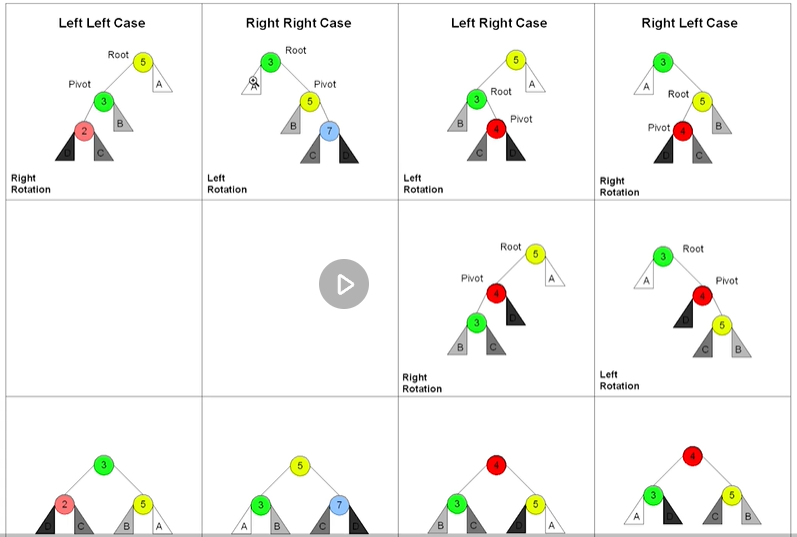

# Week7学习笔记

---

## 1. 知识点
### 1.1 字典树 Trie树

优点：最大限度的减少无效的字符串比较，查询效率比Hash表高
用途：统计和排序大量的字符串等

#### 基本性质：

- 节点本身不存完整单词
- 从根节点到某一结点，路径上经过的字符连起来，为该节点对应的字符串
- 每个节点所有的子节点路径代表的字符都不相同

#### 核心思想：

Trie树的核心思想是空间换时间
利用字符串的公共前缀来降低查询的时间开销，以达到提高效率的目的

#### Trie树实现:

```python
class Trie:
    """
    insert、search、startsWith的核心操作其实都一样：
    如果当前字母存在，就继续找，如果不存在就插入/结束。
    """
    
    def __init__(self):
        """
        Initialize your data structure here.
        """
        self.root = {}
        self.end_of_word = "#"

    def insert(self, word: str) -> None:
        """
        Inserts a word into the trie.
        """
        node = self.root
        for ch in word:
            if ch not in node:
                node[ch] = {}
            node = node[ch]
        node[self.end_of_word] = self.end_of_word

    def search(self, word: str) -> bool:
        """
        Returns if the word is in the trie.
        """
        node = self.root
        for ch in word:
            if ch not in node:
                return False
            node = node[ch]
        return self.end_of_word in node

    def startsWith(self, prefix: str) -> bool:
        """
        Returns if there is any word in the trie that starts with the given prefix.
        """
        node = self.root
        for ch in prefix:
            if ch not in node:
                return False
            node = node[ch]
        return True
```


### 1.2 并查集

#### 基本操作

- init(s):建立一个新的并查集，其中包含s个单元素集合

- unionSet(x,y):把元素x和元素y所在的集合合并，要求x和y所在的集合不相交。如果相交则不合并

- find(x): 找到元素x所在的集合代表，该操作也可以用于判断两个元素是否位于同一个集合，只需将各自的代表比较即可

代码模板：

```python
p = [i for i in range(len(M))]

def union(x, y):
    p[find_parent(x)] = find_parent(y)

def find_parent(x):
    root = x
    while p[root] != root:
        root = p[root]
    while p[x] != x:  # 路径压缩
        x, p[x] = p[x], root
    return root
```

### 1.3 高级搜索

优化方式：剪枝、双向BFS、启发式搜索(A*)

#### 1.3.1 剪枝

DFS 深度优先

```python
# 递归写法
visited = set() 
def dfs(node, visited):
    if node in visited: # terminator
        # already visited 
    	return 

    visited.add(node) 

    # process current node here. 
	...
    for next_node in node.children(): 
        if next_node not in visited: 
            dfs(next_node, visited)
			
# 非递归写法
def DFS(self, tree): 

	if tree.root is None: 
		return [] 

	visited, stack = [], [tree.root]

	while stack: 
		node = stack.pop() 
		visited.add(node)

		process (node) 
		nodes = generate_related_nodes(node) 
		stack.push(nodes) 

	# other processing work 
	...
```

BFS 广度优先

```Python
def BFS(graph, start, end):
    visited = set()
    queue = []
    queue.append([start])
    
    while queue:
        node = queue.pop()
        visited.add(node)
        
        process(node)
        nodes = generate_related_nodes(node)
        queue.push(nodes)
        
    # other processing work 
    ...
```

#### 1.3.2 双向搜索

### 双向BFS

```python
def BBFS(graph, start, end):
    visited = set()
    queue = []
    queue.append([start])
    queue_end = []
    queue_end.append([end])
    
    while queue:
        node = queue.pop()
        visited.add(node)

        process(node)
        nodes = generate_related_nodes(node)
        queue.push(nodes)
	
        if len(queue) > len(queue_end):
            queue, queue_end = queue_end, queue
        
    # other processing work 
    ...
        
```

#### 1.3.3 启发式搜索（A*）

A* Search: 在BFS的基础上引入优先队列，并存在估价函数，评估分支的好坏程度，优先对好分支进行搜索。

估价函数: h(current_state) = distance(current_state, target_state)

```python
def AstarSearch(graph, start, end):

    pq = collections.priority_queue() # 优先级 —> 估价函数
    pq.append([start])
    visited.add(start)
    
    while pq:
        node = pq.pop() # can we add more intelligence here ?
        visited.add(node)
	
        process(node)
        nodes = generate_related_nodes(node)
        unvisited = [node for node in nodes if node not in visited]
        pq.push(unvisited)
```


### 1.4 红黑树和AVL树

二叉搜索树的极端情况，退化成链表，时间复杂度由O(log n) 退化为 O(n)

改进：平衡二叉树，包括2-3树, AA树,B+ Tree, **红黑树和AVL树**

面试时只需要**阐述原理**

#### 1.4.1 AVL树: 完全平衡二叉树

- 平衡因子{-1, 0, 1}（记录左子树和右子树的高度差）
- 旋转操作（左旋，右旋，左右旋，右左旋）

- 不足: 节点需要存储额外信息（空间成本高），且调整频繁（维护成本高）

#### 1.4.2 红黑树: 近似平衡二叉树

保证任何一个节点的左右子树**高度差**小于两倍（例如，左边是5，右边可以是10，或者2.5 ）

- 每个节点要么是红色，要么是黑色
- 根节点是黑色
- 每个叶节点(NIL节点，空节点)是黑色
- 不能有相邻的两个红色节点
- 从任一节点到其中每个叶子的所有路径都包括**相同数目**的黑色节点
